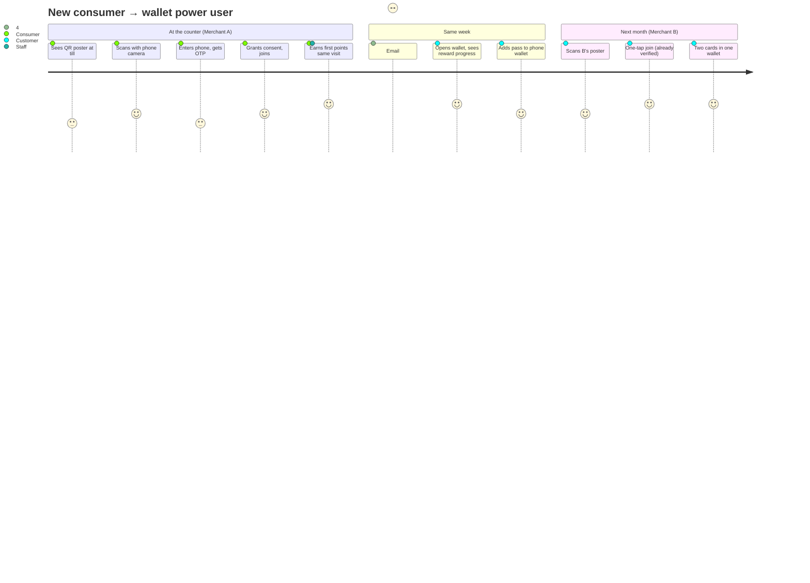
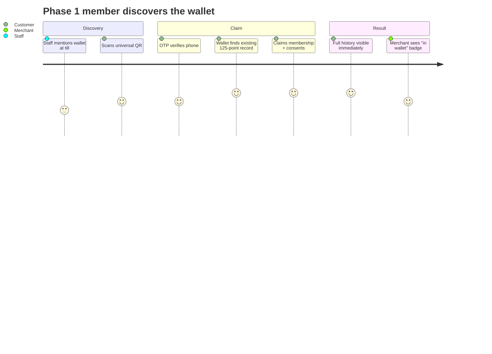
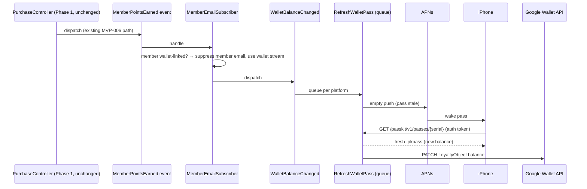
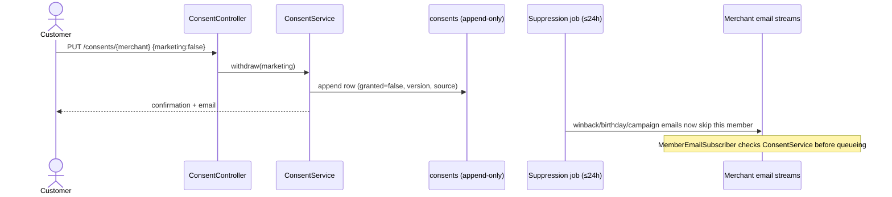
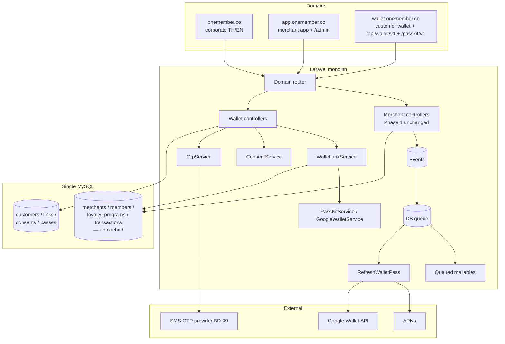
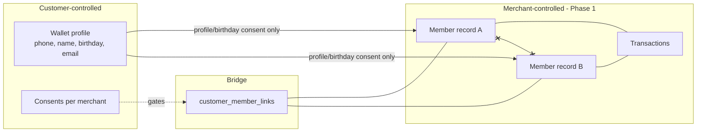

# 09 — Customer Journeys, Sequence & Architecture Diagrams

| Field | Value |
|---|---|
| **Status** | Review |
| **Last Updated** | 2026-07-05 |
| **Parent** | [README.md](./README.md) |

Diagrams are Mermaid (render in GitHub/most viewers).

---

## 1. Customer Journey — First Contact to Multi-Merchant



## 2. Customer Journey — Existing Member Claims Record



## 3. Sequence — Universal QR Join (new customer)

```mermaid
sequenceDiagram
    actor C as Consumer
    participant W as Wallet (Blade/PWA)
    participant Auth as WalletAuthController
    participant OTP as OtpService
    participant SMS as SMS Provider (BD-09)
    participant Link as WalletLinkService
    participant Cons as ConsentService
    participant DB as Database

    C->>W: GET /join/{slug}?sig
    W->>W: WalletQrService verifies HMAC sig
    W-->>C: Landing (merchant brand, join CTA)
    C->>Auth: POST otp/request {phone}
    Auth->>OTP: issue(phone)
    OTP->>DB: store code_hash (5 min TTL)
    OTP->>SMS: send 6-digit code
    C->>Auth: POST otp/verify {phone, code}
    Auth->>DB: create/find customer, phone_verified_at
    Auth-->>C: session + consent screen
    C->>Link: POST /memberships {slug, consents}
    Link->>Cons: append consent rows (versioned)
    Link->>DB: match members.phone within merchant?
    alt existing member found
        Link-->>C: offer claim (BD-05)
    else none
        Link->>DB: create Member (Phase 1 rules) + link (qr_join)
    end
    Link-->>C: membership card
    Note over Link: MembershipLinked event → email + merchant counter
```

## 4. Sequence — Balance Change Propagates to Native Pass



## 5. Sequence — Consent Withdrawal



## 6. Architecture — Phase 2 Target State



## 7. Data Boundary Diagram (privacy view)


(`x--x` = merchants never see each other's data; no cross-merchant edge exists.)
