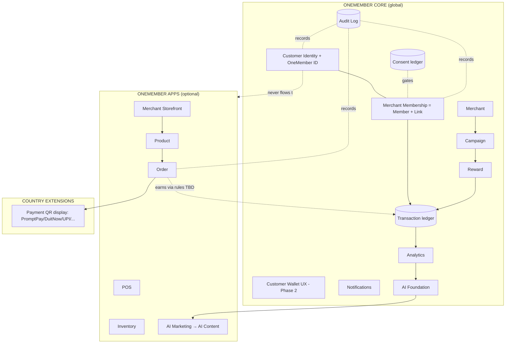
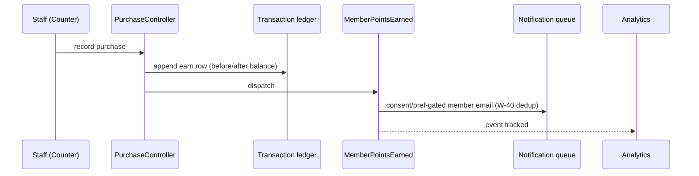
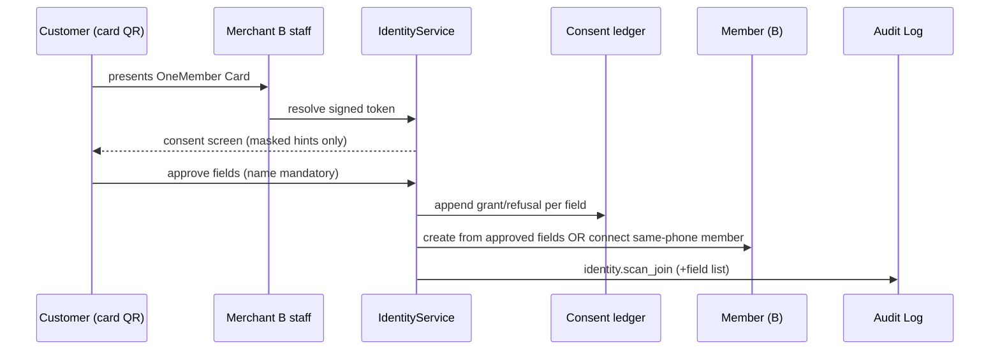
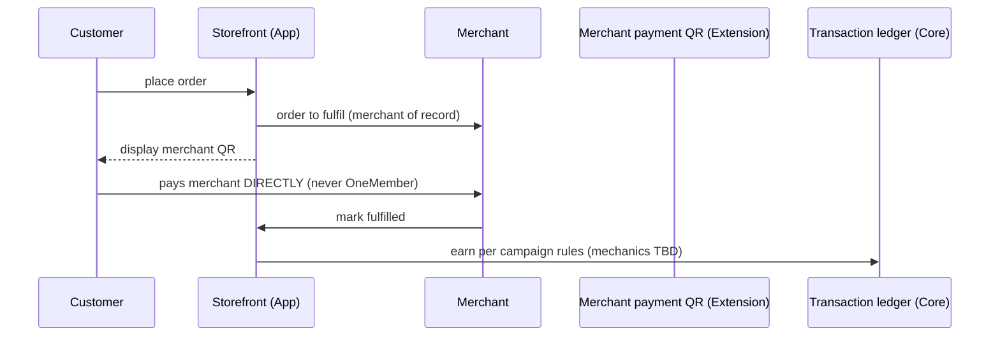
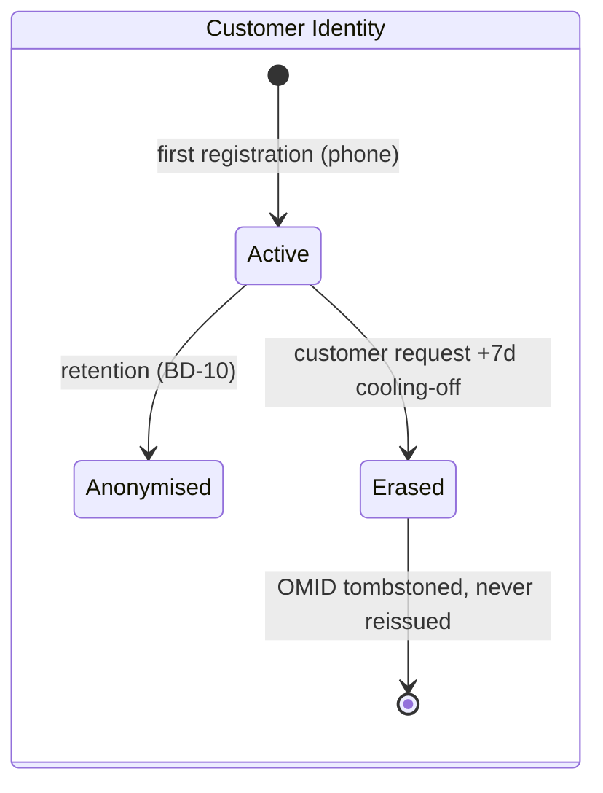
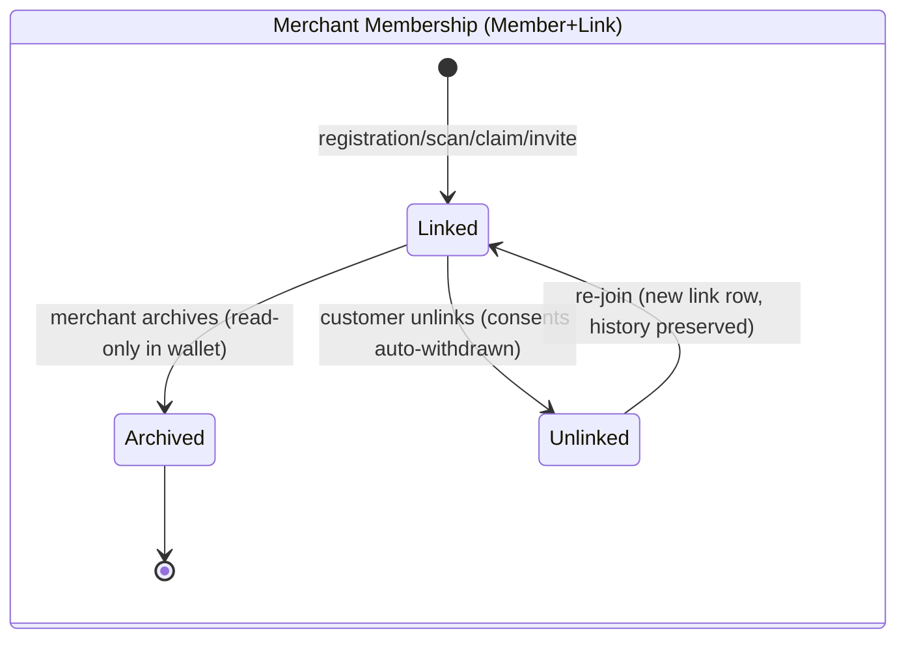
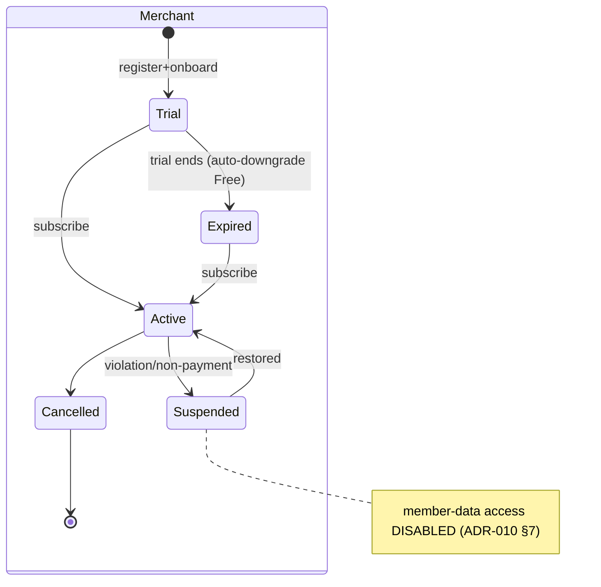
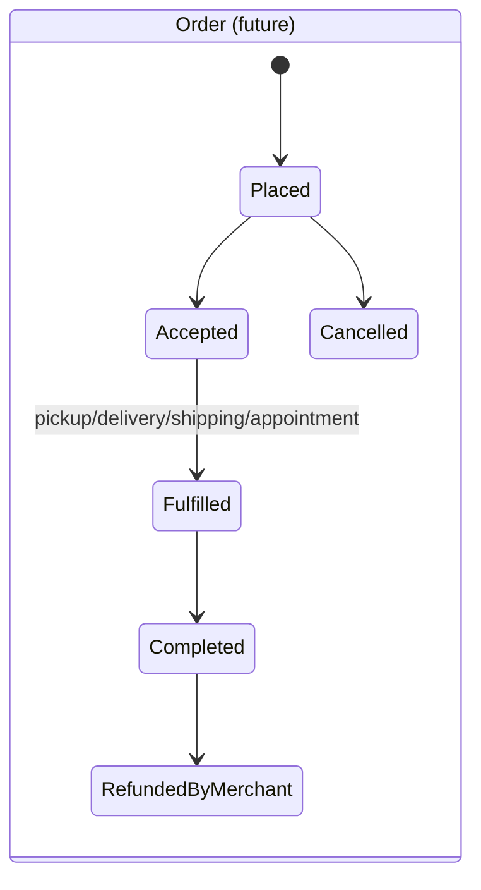

# OneMember Domain Model — Master Blueprint

| Field | Value |
|---|---|
| **Document Owner** | ChatGPT CTO |
| **Version** | 1.0.0 |
| **Status** | Active |
| **Last Updated** | 2026-07-06 |
| **Author** | Claude Fable 5 (DOMAIN-001) |
| **Related Documents** | [Product-Bible v2.0.0](../02-Product/Product-Bible.md) · [Global-Platform-Repositioning](../00-Executive/Global-Platform-Repositioning.md) · [ADR-010](../12-ADR/ADR-010-Custodian-Identity-Consent.md) · [ADR-011](../12-ADR/ADR-011-Commerce-Principles-Phase-4.md) · [ADR-012](../12-ADR/ADR-012-Modular-Platform-Core-Apps-Extensions.md) · [Customer-Wallet package](../02-Product/Customer-Wallet/README.md) · [Commerce.md](../02-Product/Commerce.md) · [Scalability-Review](./Scalability-Review-2026-07.md) |

**This is not code.** It is the master blueprint every future model, migration, and API must be checked against. Entities marked *(future)* have no implementation; their shape here constrains future design. Legend for owner: **C** = Customer, **M** = Merchant, **OM** = OneMember (custodian/technology owner per Bible Foundational Principle).

---

## 1. Entity Catalogue

Format per entity: purpose · owner · lifecycle · relationships · permissions · consent · audit · deletion · archival · scalability. Bible references cite the section of [Product-Bible v2.0.0](../02-Product/Product-Bible.md).

### 1.1 Customer Identity (`customers` — live, PH2-001A) — Core
- **Purpose:** the single global identity of a consumer; anchor = one verified mobile phone. *(Bible: Identity Model §1)*
- **Owner:** **C** owns and controls it; **OM** is custodian; **M** never owns it.
- **Lifecycle:** created at first member registration with a phone (or future wallet signup) → active → anonymised by retention job (BD-10) or erased on customer request → soft-deleted, OneMember ID never reissued.
- **Relationships:** 1—n Customer Member Links; 1—n Consents; 1—1 OneMember ID + Card; (future) 1—n Notifications, 1—1 Wallet profile.
- **Permissions:** customer reads/edits own profile (future wallet); merchants see **only** consented fields materialised into their own Member record — never the identity itself; OM admin sees operational metadata, not browsing-profile dashboards.
- **Consent:** any flow of its fields to a merchant requires explicit per-field consent (ADR-010).
- **Audit:** `identity.created`, profile changes, erasure requests.
- **Deletion:** customer-initiated erasure → 7-day cooling-off → hard-delete PII, sever links; Member records remain with merchants under their own controllership (Bible Privacy Model).
- **Archival:** inactive ≥ 24 months (proposal, BD-10) → anonymise in place.
- **Scalability:** target 3M+ rows; unique phone index is the hot path; trivial by volume.

### 1.2 OneMember ID (attribute of Customer, `onemember_id` — live) — Core
- **Purpose:** permanent human-readable identity handle (`OM-XXXX-XXXX`), printed on the Card, encoded (signed) in the QR. *(Bible: Identity Model §5)*
- **Owner:** **C** (it is their identity); format and issuance are **OM** technology.
- **Lifecycle:** issued once at identity creation; immutable; never recycled, even after erasure (tombstone the value).
- **Relationships:** 1—1 Customer; referenced by QR tokens, future passes.
- **Permissions:** public-by-presentation (customer chooses when to show it); resolving it to data always requires OM-mediated consent flows.
- **Consent:** the ID itself carries no PII; resolving to profile fields is consent-gated.
- **Audit:** issuance (in `identity.created`), every resolution via scan (`identity.scan_join`).
- **Deletion/Archival:** never deleted; tombstoned on erasure so it cannot be reissued.
- **Scalability:** 30-char alphabet ^8 ≈ 6.5×10¹¹ space; collision-checked at generation.

### 1.3 Customer Wallet (Phase 2 UX — designed PH2-000, not yet built) — Core
- **Purpose:** the customer-facing surface over identity + links: card list, balances, history, consents, passes. *(Bible: Platform Structure — Core)*
- **Owner:** **C** (their view of their own data); **OM** provides the surface.
- **Lifecycle:** activates when customer authenticates (OTP — BD-09); dormant identity ≠ no wallet, it's a wallet not yet claimed.
- **Relationships:** projection over Customer, Links, Consents, per-merchant Member data (read-through, consent-gated).
- **Permissions:** customer-only; merchants never see the wallet or its other memberships (ADR-010 hard rule).
- **Consent:** displaying a merchant's loyalty data inside the wallet required the link consent; wallet itself adds none.
- **Audit:** logins, exports, deletion requests.
- **Deletion:** wallet account deletion = identity erasure flow.
- **Scalability:** read-heavy; card-list caching invalidated by balance events (PH2-001D spec).

### 1.4 Merchant (`merchants` — live) — Core
- **Purpose:** the business tenant: profile, settings, subscription, branding. *(Bible: Who OneMember Serves — Primary)*
- **Owner:** **M** owns their business data; **OM** owns the platform account mechanics.
- **Lifecycle:** registered → onboarding → trial → active/paid ⇄ suspended/expired → cancelled (soft-deleted).
- **Relationships:** 1—n Members, Campaigns, Rewards, Transactions, Consents (as counterparty), Links (as scope), installed Apps *(future)*, Country Extension configs *(future)*; 1—1 owner User.
- **Permissions:** merchant users manage own tenant only (CTO-005); platform admin (`is_admin`) reads cross-tenant operational data.
- **Consent:** n/a for own data; access to member data conditioned on **active subscription** (ADR-010 §7).
- **Audit:** subscription/status changes (SecurityLogger), settings changes (future audit_logs expansion).
- **Deletion:** soft-delete; member PII disposition on merchant exit is a **named open decision (DR-35)** — data return/erasure protocol needed pre-GA.
- **Archival:** suspended merchants retain data, lose access until restored.
- **Scalability:** 100k target (SCALE-000 verdict: fine).

### 1.5 Merchant Membership (`members` + `customer_member_links` — live) — Core
- **Purpose:** the local relationship of one customer at one merchant: profile-as-shared, points, status. The link ties it to the global identity. *(Bible: Identity Model §2/§6 — identity shared, loyalty local)*
- **Owner:** **M** owns the Member record (their business relationship); the **link** is custodial (**OM**) and consent-derived; **C** controls whether it exists.
- **Lifecycle:** created (registration / scan-to-join / claim / invite — provenance in `linked_via`) → active/inactive → archived (merchant) or unlinked (customer) → soft-deleted.
- **Relationships:** Member n—1 Merchant; Link: Member 1—1 Customer (unique member_id), one live link per (customer, merchant).
- **Permissions:** merchant CRUD within tenant; customer sees own memberships via wallet/portal; other merchants: nothing.
- **Consent:** creation via scan-to-join requires per-field consent; field sync honours the ledger; unlink auto-withdraws consents.
- **Audit:** `identity.linked` / `identity.scan_join`; member archive events.
- **Deletion:** member soft-delete (merchant); unlink (customer) keeps the Member with the merchant, severs the identity bridge.
- **Archival:** archived members read-only in wallet (E-03).
- **Scalability:** 1M+ members / links; covered by SCALE-001 indexes.

### 1.6 Campaign (`loyalty_programs` — live; ADR-007 naming) — Core
- **Purpose:** merchant-defined earning rules (points/stamps), birthday/expiry settings. *(Bible: merchants own loyalty rules)*
- **Owner:** **M** (rules/content); **OM** (engine).
- **Lifecycle:** draft → active → paused → archived (soft-delete). Currently oldest-active wins purchases (BD-15 open).
- **Relationships:** n—1 Merchant; 1—n Rewards, Transactions.
- **Permissions:** merchant-only; members see derived progress, never raw config.
- **Consent:** none (merchant business data).
- **Audit:** lifecycle changes (analytics-tracked; formal audit rows = future).
- **Deletion/Archival:** soft-delete; history retained because Transactions reference it (withTrashed reads).
- **Scalability:** small table; settings JSON null-safe (CTO-008).

### 1.7 Reward (`rewards` — live) — Core
- **Purpose:** redeemable benefit priced in points/stamps. **Merchant-local; never merges across merchants.**
- **Owner:** **M**; engine **OM**.
- **Lifecycle:** draft → active ⇄ archived (soft-delete); quantity-limited variants decrement.
- **Relationships:** n—1 Campaign, n—1 Merchant; 1—n Redemptions.
- **Permissions:** merchant CRUD; members view eligible rewards.
- **Consent:** none.
- **Audit:** redemption creates Redemption + Transaction rows (the ledger IS the audit).
- **Deletion/Archival:** soft-delete keeps historical redemption integrity (RELEASE-4A shows archived rewards in analytics).
- **Scalability:** small.

### 1.8 Transaction (`transactions` — live) — Core
- **Purpose:** the immutable loyalty ledger: every earn/redeem/adjust/expire/birthday movement with before/after balances. *(Glossary: "Every point or stamp movement must produce a Transaction record")*
- **Owner:** **M** (their programme's ledger); **OM** (ledger technology). Customer has read access to own entries.
- **Lifecycle:** append-only; **never updated or deleted** (corrections are compensating `adjust` entries).
- **Relationships:** n—1 Member, Merchant, Campaign; 1—0..1 Redemption.
- **Permissions:** merchant reads own; member reads own via portal/wallet; admin reads aggregates.
- **Consent:** none within the merchant relationship (merchant's own record); cross-merchant visibility never exists.
- **Audit:** it is itself the audit ledger for loyalty value.
- **Deletion:** never. Customer erasure keeps rows (merchant's lawful business record), identity bridge severed.
- **Archival:** partition/archive by year at ~100M rows (Scalability B-12/§3 tier 🟢).
- **Scalability:** THE big table — 100M target certified; SCALE-001 indexes cover the read paths; rollups (B-09) protect it at Year 1.

### 1.9 Activity (derived view — live as filtered Transactions + Redemptions) — Core
- **Purpose:** human-readable timeline (member activity tab, dashboard recent activity, admin feeds). Not a stored entity today — a projection.
- **Owner/permissions/consent/deletion:** inherit entirely from the underlying ledger rows.
- **Future:** if product needs non-ledger activities (logins, notes), introduce `activities` as append-only with the same rules as Transaction — **do not** widen the transactions table.
- **Scalability:** reads ride ledger indexes + future rollups.

### 1.10 Order *(future — Commerce App, Phase 4)* — App
- **Purpose:** a customer's order from a merchant (merchant of record) — cart, fulfillment mode, status. *(Bible: Commerce Principles; ADR-011)*
- **Owner:** **M** (it is their sale); **OM** provides ordering rails only.
- **Lifecycle (planned):** draft/cart → placed → accepted → fulfilled (pickup/delivery/shipping/appointment) → completed | cancelled | refunded-by-merchant.
- **Relationships:** n—1 Merchant, n—1 Member (or guest?— open, Phase 4 planning), n—m Products; may emit loyalty Transactions (earn on order — mechanics TBD, Commerce.md open items).
- **Permissions:** merchant manages own orders; customer sees own orders.
- **Consent:** ordering implies contact for that order (contract basis); marketing stays consent-gated.
- **Audit:** status transitions must be audited (disputes).
- **Deletion:** merchant business record — retained per merchant tax obligations; customer erasure pseudonymises the link, never deletes the merchant's invoice record.
- **Payment:** **no payment entity in OneMember** — QR display only; at most an unverified "customer indicated paid" marker (open item).
- **Scalability:** design append-heavy like Transactions; per-merchant scoping identical.

### 1.11 Product *(future — Commerce App)* — App
- **Purpose:** merchant catalogue item (goods/services): name, price, images, category, availability. *(Bible: merchants own products & prices)*
- **Owner:** **M** entirely.
- **Lifecycle:** draft → active ⇄ hidden → archived.
- **Relationships:** n—1 Merchant; n—m Orders; n—1 Category; optional Inventory App linkage.
- **Permissions:** merchant CRUD; public read only where storefront published.
- **Consent:** none (no personal data). Images via object storage (ADR-009).
- **Deletion/Archival:** soft-delete; ordered products must remain resolvable from historical Orders.
- **Scalability:** catalogue sizes modest; images on CDN.

### 1.12 Merchant Storefront *(future — Commerce App)* — App
- **Purpose:** the merchant's published, branded ordering surface (catalogue + cart + fulfillment options + payment QR display). *(Bible: Commerce §1–2; Repositioning §4)*
- **Owner:** **M** (content/config); **OM** (rails).
- **Lifecycle:** unpublished → published ⇄ paused; exists only while Commerce App installed **and** subscription active.
- **Relationships:** 1—1 Merchant; fronts Products/Orders; reuses merchant branding assets.
- **Permissions:** public read when published; merchant config.
- **Consent:** storefront browsing collects nothing; ordering per §1.10.
- **Audit:** publish/unpublish events.
- **Deletion:** App uninstall policy = **DR-34** (data retained dormant vs exported — do not assume).
- **Scalability:** public + cacheable; CDN full-page candidates.

### 1.13 Consent (`consents` — live, append-only) — Core
- **Purpose:** the ledger of every customer decision about sharing each data type with each merchant. *(Bible: Privacy Model §3; ADR-010 §4)*
- **Owner:** **C** makes the decisions; **OM** custodian of the record; **M** is counterparty, never editor.
- **Lifecycle:** append-only rows (granted true/false, versioned copy, source); current state = latest row; model-level guard throws on update/delete.
- **Relationships:** n—1 Customer, n—1 Merchant.
- **Permissions:** customer reads/changes own (privacy centre, PH2-001C); merchant sees only the effective state for its own scope; enforcement is exclusively via the consent service layer.
- **Audit:** it is itself an audit structure; changes additionally logged.
- **Deletion:** never deleted in operation; retained ~5 years post-closure (BD-10 proposal) as legal defence, then purged.
- **Scalability:** append-mostly; yearly partitioning at ~50M rows (B-13).

### 1.14 Audit Log (`audit_logs` — live) — Core
- **Purpose:** who did what to which record, when, from where — identity events today; every sensitive/destructive action over time. *(Glossary: Audit Log)*
- **Owner:** **OM** (platform integrity record).
- **Lifecycle:** append-only; no update path.
- **Relationships:** morphs to any auditable; optional user + merchant scope.
- **Permissions:** platform admin + (future) merchant-scoped subset for enterprise (Master Roadmap §7); never customer-visible raw.
- **Consent:** exempt (legitimate interest — security), but payloads must not carry unnecessary PII (mask like logs).
- **Deletion:** retention window ops 90d / security-relevant 1y+ (BD-10 family); then purge.
- **Scalability:** high-write; index (event, merchant_id, created_at); ship to central log sink at multi-node (§1.18 logging).

### 1.15 Notification (email live via mailables/log; entity future) — Core
- **Purpose:** messages to merchants and members/customers (transactional + consent-gated marketing) across email → LINE/push (BD-08).
- **Owner:** **OM** (rails); **M** (marketing content within consent); **C** (channel preferences — future).
- **Lifecycle:** event → eligibility (consent + preferences + dedup rule W-40) → queued → sent/failed (logged).
- **Relationships:** to User or Member/Customer; sourced from domain events (CTO-003 — never from controllers).
- **Permissions:** recipients see own; merchants see delivery states for their campaigns (future).
- **Consent:** marketing requires `marketing` consent (wallet-linked members) / merchant email prefs (merchants); transactional rides contract basis.
- **Audit:** email log (EmailLogger) is the delivery audit.
- **Deletion:** delivery logs pruned on ops retention.
- **Scalability:** queue-bound; Redis + Horizon (ADR-009); batch windows for birthday storms (B-05 pattern).

### 1.16 AI Content *(future — Phase 3 growth tools / AI Marketing App)* — Core foundation + App
- **Purpose:** AI-generated drafts: campaign copy, insights text, summaries, advisor plans. *(Master Roadmap §5; Bible: OM owns AI Foundation)*
- **Owner:** **OM** (foundation/models); **M** owns approved outputs used in their marketing; drafts are suggestions, not records of fact.
- **Lifecycle:** generated → merchant reviews → approved (becomes merchant content, versioned) | discarded. **AI never auto-sends** (Master Roadmap guardrail).
- **Relationships:** n—1 Merchant; references source aggregates (never raw cross-merchant data).
- **Permissions:** merchant-scoped; prompts/contexts must never include other tenants' data.
- **Consent:** generation from a merchant's own aggregates = their data; member-level personalisation respects `analytics`/`marketing` consents.
- **Audit:** approval events audited (who approved what content that reached customers).
- **Deletion:** drafts prunable; approved content retained with the campaign that used it.
- **Scalability:** external LLM COGS gated per plan; queue-based generation; cache aggregates.

### 1.17 Analytics (events live via AnalyticsService; rollups future) — Core
- **Purpose:** merchant-facing performance views (dashboard, RELEASE-4A campaign analytics), platform admin metrics, future anonymised network insights.
- **Owner:** **M** for their own analytics; **OM** for platform-level and anonymised aggregates. **Never** cross-merchant profiling visible to merchants (Doc 06 §8).
- **Lifecycle:** raw events/ledger → (Year 1) nightly rollup tables → dashboards; rollups are rebuildable derived data, never authoritative.
- **Relationships:** derived from Transactions/Members/Redemptions/Orders(future); rollups keyed (merchant_id, day).
- **Permissions:** merchant sees own; admin sees platform; consent-gated member-level views respect `analytics` consent (linked members).
- **Consent:** merchant's own transactional analytics = their record; anonymised network stats = aggregate-only legitimate interest.
- **Audit:** n/a (derived); rollup job runs logged.
- **Deletion:** rollups regenerable; anonymised aggregates retain no per-person data.
- **Scalability:** the designated pressure-relief valve for the 100M-row ledger (B-09).

---

## 2. ER Diagram (implemented core, today)

```mermaid
erDiagram
    CUSTOMER ||--o{ CUSTOMER_MEMBER_LINK : "identity for"
    CUSTOMER ||--o{ CONSENT : decides
    MERCHANT ||--o{ CONSENT : counterparty
    MERCHANT ||--o{ MEMBER : owns
    MERCHANT ||--o{ LOYALTY_PROGRAM : owns
    MERCHANT ||--o{ REWARD : owns
    MERCHANT ||--o{ TRANSACTION : scoped
    MEMBER ||--o| CUSTOMER_MEMBER_LINK : "bridged by"
    MEMBER ||--o{ TRANSACTION : earns
    MEMBER ||--o{ REDEMPTION : redeems
    LOYALTY_PROGRAM ||--o{ REWARD : offers
    LOYALTY_PROGRAM ||--o{ TRANSACTION : rules
    REWARD ||--o{ REDEMPTION : claimed
    REDEMPTION ||--|| TRANSACTION : "debits via"
    USER ||--o| MERCHANT : owns
    AUDIT_LOG }o--|| CUSTOMER : "morphs to (etc.)"

    CUSTOMER {
        uuid public_uuid
        string onemember_id UK
        string phone UK
        string name
    }
    CUSTOMER_MEMBER_LINK {
        fk customer_id
        fk member_id UK
        fk merchant_id
        string linked_via
        ts unlinked_at
    }
    CONSENT {
        fk customer_id
        fk merchant_id
        string data_type
        bool granted
        string consent_version
    }
    MEMBER {
        fk merchant_id
        string phone
        int total_points
    }
    TRANSACTION {
        fk merchant_id
        fk member_id
        fk loyalty_program_id
        string type
        int points
    }
```

## 3. Relationship Diagram — Layers & Future Entities



## 4. Data Ownership Matrix

| Entity | Customer | Merchant | OneMember | Notes |
|---|---|---|---|---|
| Customer Identity / OneMember ID | **Owns/controls** | — | Custodian | Bible Foundational Principle |
| Customer Wallet | **Owns view** | — | Provides surface | |
| Merchant profile/settings | — | **Owns** | Account mechanics | |
| Member record | — | **Owns** | Stores | Merchant's business relationship |
| Link (identity↔member) | Controls existence | Beneficiary | **Custodian** | Consent-derived |
| Campaign / Reward | — | **Owns rules/content** | Owns engine | |
| Transaction ledger | Reads own | **Owns ledger** | Ledger tech | Immutable |
| Order / Product / Storefront *(future)* | Reads own orders | **Owns** (seller of record) | Rails only | ADR-011 |
| Consent ledger | **Decides** | Counterparty | Custodian | Append-only |
| Audit Log | — | Scoped view (future) | **Owns** | |
| Notification content (marketing) | Preference-holder | **Owns content** | Rails | Consent-gated |
| AI Content | — | **Owns approved output** | Owns foundation | Never auto-sent |
| Analytics (own-merchant) | — | **Owns** | Computes | |
| Analytics (network, anonymised) | — | — | **Owns** | Aggregate-only, never resold |

## 5. Permission Matrix (read R / write W / none —)

| Entity | Customer (self) | Merchant staff (own tenant) | Other merchant | Platform admin |
|---|---|---|---|---|
| Customer Identity profile | R/W (wallet, future) | — (consented fields land in own Member only) | — | ops metadata R |
| OneMember ID + Card | R (present at will) | resolve-via-consent only | same | R |
| Member (own tenant) | R (own membership) | R/W | — | R (support) |
| Campaign/Reward | derived progress R | R/W | — | R |
| Transactions | R own | R/W (append) | — | R aggregate |
| Orders *(future)* | R own | R/W | — | R aggregate |
| Consents | R/W own | effective-state R (own scope) | — | R (compliance) |
| Audit Log | — | scoped R (future) | — | R |
| Analytics | — | own R | — | platform R |
| **Gate on all merchant access:** active account + subscription (ADR-010 §7) | | | | |

## 6. Consent Matrix (data type × basis)

| Data flow | Basis | Consent artefact |
|---|---|---|
| Registration at a merchant (fields typed by/for customer present) | Contract/registration | link `linked_via=registration`; no cross-merchant flow |
| Identity fields → new merchant via scan-to-join | **Explicit per-field consent** | consent rows name/phone/email/birthday/postal (grants AND refusals) |
| Existing member record connect (claim) | **Explicit consent** | ADR-010 §3 (auto-link superseded) |
| Loyalty history shown in wallet | **Customer approval** | link + Bible Identity §3 |
| Merchant marketing to linked member | **`marketing` consent** | PH2-001C data types |
| Merchant analytics incl. linked member detail | **`analytics` consent** | PH2-001C |
| Transactional notices (points earned, order status) | Contract | none needed |
| Anonymised network analytics | Legitimate interest, aggregate-only | none; no per-person output |
| Merchant→merchant anything | **FORBIDDEN — never automatic** | Bible Privacy §4 |

## 7. Event Flow Diagrams

### 7.1 Loyalty earn (live)


### 7.2 Scan-to-join (live, PH2-001A)


### 7.3 Order → loyalty *(future, Commerce App — constraints only)*


## 8. Lifecycle Diagrams






## 9. Future Extension Points

| Extension point | Mechanism reserved |
|---|---|
| New link provenance (bridge, wallet self-join) | `linked_via` string values |
| New consent categories (marketing, analytics, per-App scopes) | `data_type` string + `consent_version` per market |
| App installs | merchant `installed_apps` (CORE-001) — every App keys features off it |
| Country Extensions | merchant `country` drives extension availability; payment-QR display adapters behind one interface |
| Ledger events (order-earn, referral bonus, tier bonus) | `transactions.type` enum extension + compensating-entry rule |
| Identity channels (OTP auth, LINE login) | customers table per PH2-000 Doc 03 (OTP fields deferred, additive) |
| Passes (Apple/Google) | `wallet_passes` per PH2-000 Doc 03/07; card layout already pass-shaped |
| Tiers (PL-001) | computed on Member (merchant-local), displayed via wallet card projection |
| Enterprise Bridge | Links with `linked_via=bridge`; Bridge API separate from Wallet API |
| Rollups | `daily_merchant_stats` / `daily_campaign_stats` (Scalability B-09) — derived, rebuildable |

## 10. Bible Cross-Reference Index

| Entity | Product Bible v2.0.0 anchor |
|---|---|
| Customer Identity, OneMember ID, Card, scan-to-join | Identity Model §1–6 |
| Customer Wallet | Platform Structure (Core) + Customer-Wallet package |
| Merchant, subscription-gated access | Who OneMember Serves; Privacy & Access Model §2 |
| Merchant Membership / no-merge loyalty | Identity Model §2/§4; Foundational Principle |
| Campaign, Reward, Transaction | One-Line Principle (loyalty engine OM, rules merchant); Glossary Loyalty section |
| Activity | Glossary Transaction invariant |
| Order, Product, Storefront | Commerce Principles §1–7; ADR-011; Commerce.md |
| Consent | Privacy & Access Model §3–4; ADR-010 |
| Audit Log | Glossary Technical Terms; ADR-010 consequences |
| Notification | CTO-003 event-driven rule; consent matrix §6 |
| AI Content | Bible ownership split (AI Foundation = OM); Master Roadmap §5 guardrails |
| Analytics | Bible Product Rule 5 (success metrics); never-become list (no data broker) |
